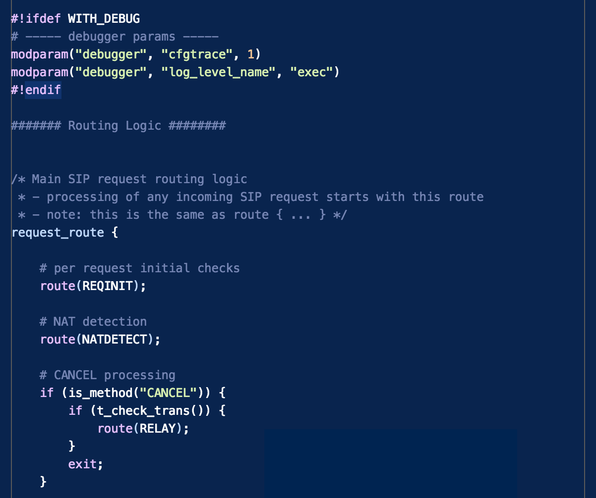

# VSCode Extension - Kamailio Syntax Highlighting

This Visual Studio Code (VSCode) extension provides syntax highlighting for editing Kamailio SIP Server configuration files.

More details about Kamailio SIP Server project can be found at:

  * https://www.kamailio.org

The code for this extension is hosted at:

  * https://github.com/miconda/vscode-kamailio-syntax

## Features

Syntax highlighting for:

  * line comments
  * block comments
  * preprocessor directive
  * routing block names
  * variables
  * string and integer values
  * reserved keywords

A screenshot while editing the kamailio.cfg file with this extension enabled:

## Installation

To use this extension with VSCode copy it into the `<user home>/.vscode/extensions` folder and restart the editor.

## Known Issues

Tested only on MacOS.

## Release Notes

### 1.0.0 (2017-04-24)

Initial release.

**Enjoy!**